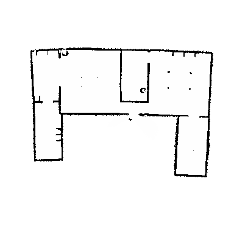
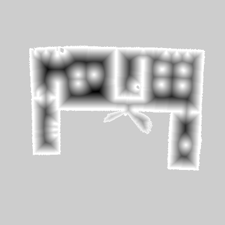

# Project 3 - Task 1

## Description

In this project we implemented the motion model and sensor model for a triton robot in a 2D environment.

## Docs

you can find the lookup_table png file in `scripts/imgs` folder.
also motion_model and sensor_model algorithms are in the scripts folder.

In the script folder, `generate_likelihood_field.py` is used to generate the likelihood field for the sensor model. `motion_model.py` is used to implement the motion model. `sensor_model.py` is used to implement the sensor model.


Environment map:



Lookup table:




## Particle Filter

The core of this project lies in the implementation of the particle filter algorithm, a probabilistic method used for state estimation in robotics. Within the `particle_filter.py` module, we encapsulate the functionality of the particle filter within the `ParticleFilter` class.

### ParticleFilter Class

#### Methods:

- `__init__(self, num_particles, map_limits, motion_model, sensor_model, lookup_table, resample_threshold)`: This method initializes the particle filter with essential parameters such as the number of particles, map limits defining the environment's boundaries, motion model, sensor model, precomputed lookup table for sensor model optimization, and a resampling threshold.
  
- `particle_filter(self, u, z)`: The `particle_filter` method updates the particle filter based on the received control input `u` and sensor measurement `z`. It incorporates these inputs to estimate the robot's state, represented by a set of particles.

- `publish_particles(self)`: Once the particle filter is updated, the `publish_particles` method visualizes the particles on the map, providing a visual representation of the robot's estimated location and uncertainty.

### Main Function

In the `main` function, we orchestrate the execution of the particle filter algorithm. It consists of a loop that simulates the robot's movement, generates sensor measurements, updates the particle filter with these inputs, and visualizes the estimated robot's position through particle representation on the map.

This modular structure facilitates seamless integration into larger robotic systems, enabling accurate localization and mapping capabilities crucial for autonomous navigation and robotic tasks in dynamic environments.

## How to run
to run the code first launch the `particle_filter.launch` file in the launch folder.
```bash
roslaunch cs603_particle_filter particle_filter.launch 
```

in a new terminal run the following command to publish the particles
```bash

rosrun cs603_particle_filter particle_filter.py
```

to navigate the robot around:
```bash
rosrun cs603_particle_filter teleop_particle_filter.py
```
